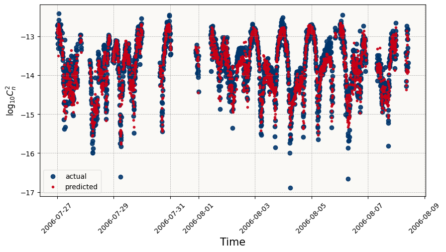
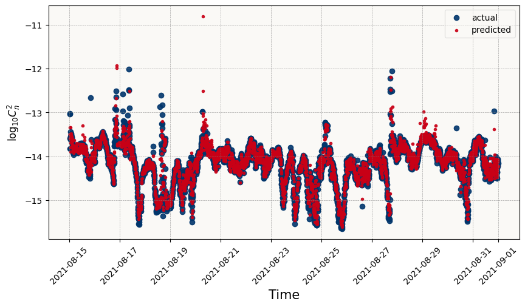

<div align="center">
    <h2><b>otbench</b> - Effective Benchmarks for Optical Turbulence Modeling</h2>
</div>


[](https://coveralls.io/github/CDJellen/otbench?branch=main)
[](https://pypi.org/project/otbench/#history)
[](https://pypi.org/project/otbench/)
[](https://pypi.org/project/otbench/)
[](https://www.linkedin.com/in/cdjellen/)
[](https://github.com/cdjellen/ndbc-api/blob/main/LICENSE)
[](https://pypi.org/project/otbench/)


### Overview

`otbench` is a Python package for benchmarking optical turbulence models.

The package currently covers regression and forecasting for modeling the strength of optical turbulence as measured during diverse operational studies. `otbench` is centered around "Tasks" which specify a dataset, target variable, data splits, evaluation metrics, and operational metadata. The package provides a consistent interface for running models on these tasks, and for comparing the results of different models.

`otbench` is designed to be easy to use, and to provide a consistent interface for comparing different models. It is also designed to be extensible, so that new tasks and datasets can be added easily. The package is built on top of `xarray`, `scikit-learn` and `pandas`, and is designed to be compatible with the broader Python data science ecosystem.

### Features

*Environmentally Diverse Datasets* 

`otbench` includes a variety of datasets from different operational studies. These datasets include measurements of optical turbulence strength, as well as environmental data such as wind speed, temperature, and relative humidity. The datasets are stored as `xarray` objects, which provide a consistent interface for working with the data.

*Consistent Interface for Model Evaluation*

Comparing different models can be difficult, especially when the models are trained and evaluated on different datasets. `otbench` provides a consistent interface for evaluating models on different tasks. This makes it easy to compare the performance of different models, and to compare the performance of a single model on different tasks.

*Extensible*

`otbench` is designed to be extensible, so that new tasks and datasets can be added easily. We welcome any and all outside contributions, including new datasets, tasks, and baseline models. As the number of datasets grows, `otbench` will become an increasingly useful tool for comparing different models, the applicability of specific models across propagation environments and over time, and identifying best practices for across the optics and machine learning communities.

### Installation

You can install `otbench` using a Python package manager such as `pip`.

The package is available on PyPi, versioned using the date of release. We will work to ensure compatibility with the last three major versions of Python, but have designed the package to be compatible with Python 3.6 and above.


#### From PyPi

PyPi is the recommended installation method. You can install the latest release using `pip`:

```bash
pip install otbench
```

#### From Source

If you want to install the latest development version, or would like to make a contribution you can install from source. You can clone the repository using `git`:

```bash
git clone https://github.com/CDJellen/otbench.git
cd otbench
pip install -e .
```

#### Requirements

The current dependencies are listed in `requirements.txt`. We strongly recommend installing the package in a virtual environment.

_Requirements_:
```bash
numpy>=1.22
pandas==1.3.5
scikit-learn>=1.0.1
xarray>=2022.3.0
netcdf4>=1.6.0
matplotlib==3.5.3
requests==2.22.0
astral==2.2
```

You can install them using `pip`:

```bash
pip install -r requirements.txt
```

If you would like to make a contribution, please install the development dependencies as well:

```bash
pip install -r requirements-dev.txt
```

### Usage

The package seeks to balance ease of use with evaluation extensibility across ecosystems. Examples of how to use the package are provided in the [notebooks](./notebooks/) directory.

#### Tasks

A deeper overview of the package structure, the concept of a "Task", and the available tasks is provided in [this notebook](./notebooks/overview.ipynb).

The task object, either a `RegressionTask` or a `ForecastingTask`, provides a consistent interface for obtaining the full underlying dataset, specific data slices, evaluating models, and comparing newly-developed models against existing benchmarks. It specifies the dataset, target variable, data splits, evaluation metrics, and operational metadata. The package provides a consistent interface for running models on these tasks, and for comparing the results of different models.

Tasks are obtained by name using the `TaskApi`:

```python
from otbench import TaskApi

task_api = TaskApi()
# use the task which removes missing measurements
mlo_cn2 = task_api.get_task("regression.mlo_cn2.dropna.Cn2_15m")

# obtain the full dataset
ds = mlo_cn2.get_dataset()

# obtain the task-specific training data
X_train, y_train = mlo_cn2.get_train_data()

# evaluate a model on the task
model = ...
mlo_cn2.evaluate_model(predict_call=model.predict)

# compare a model against the task's benchmarks
mlo_cn2.get_benchmark_info()

# add the model to the task's benchmarks
mlo_cn2.evaluate_model(
            predict_call=model.predict,
            include_as_benchmark=True,
            model_name="my_model",
        )
```

The full set of tasks, along with their complete definition and metadata, is available as a [JSON file](./otb/config/tasks.json).

#### Regression

We provide an overview of the process for training a regression model on the [`mlo_cn2`](https://doi.org/10.26023/CQR2-TQJ9-AH10) dataset[^1] using the [`LightGBM`](https://papers.nips.cc/paper/6907-lightgbm-a-highly-efficient-gradient-boosting-decision-tree) [package](https://pypi.org/project/lightgbm/). We develop a Gradient Boosted Regression Tree (GBRT) [model](http://dx.doi.org/10.1364/AO.416680)[^2] for predicting the strength of optical turbulence in [this notebook](./notebooks/regression/mlo_cn2.ipynb).

[](./notebooks/regression/mlo_cn2.ipynb)

#### Forecasting

We provide a similar overview for the process of developing a forecasting model specific to the full `usna_cn2_sm` forecasting task. Under this task, the next measurement of $C_n^2$ is predicted using the prior 6 observations of $C_n^2$ and the available environmental variables. The example model and forecasting baseline are available in [this notebook](./notebooks/forecasting/usna_cn2_sm.ipynb).

[](./notebooks/forecasting/usna_cn2_sm.ipynb)

### Contributing

All contributions are welcome! We are especially interested in contributions that add new datasets, tasks, and benchmark models. We are also interested in contributions that improve the documentation, add new examples, or improve the codebase. When contributing, please follow the [contributing guidelines](./CONTRIBUTING.md), and ensure that your code passes the tests and linting. If you have any questions, please feel free to open an issue or reach out to the maintainers.

#### Adding new datasets

New datasets can be added by following the instructions in the [data documentation](./otb/data/README.md). We strongly prefer datasets to conform to the NetCDF4 format, and to be stored in the `data/` directory. If you have a dataset that you would like to add, but are unable to convert it to NetCDF4, please reach out to the maintainers.

#### Adding new tasks

New tasks, if they are based on existing datasets, can be added directly to [the task specifications file](./otb/config/tasks.json).  If you would like to add a new task which uses a new dataset, please include the new dataset first or on the same pull request. The existing tasks provide a good template for how to specify a new task. More information is available in the [data documentation](./otb/data/README.md). If you have any questions, please reach out to the maintainers.

We strive to avoid a combinatorial explosion of tasks, and to ensure that the tasks are representative of the broader optical turbulence modeling problem. If you have any questions about whether a new task is appropriate, please reach out to the maintainers.

#### Adding new benchmark models

The set of benchmark models in the current release of `otbench` are relatively sparse, and serve mostly to gauge whether a new model provides any improvement over standard climatology or persistence techniques. Some literature models are also included to asses their performance against new data collected over a diverse set of measurement campaigns. We welcome contributions of new benchmark models, especially those that are designed to be more representative of the broader optical turbulence modeling problem, and which can generate predictions across multiple datasets.

#### Other contributions to the codebase

The set of evaluation metrics and plotting functions is relatively sparse, and we welcome contributions of new metrics and plots. We also welcome contributions that improve the documentation, add new examples, or improve the codebase. If you have any questions, please feel free to open an issue or reach out to the maintainers.

### Citing `otbench`

If you use `otbench` in your research, please cite the package using the following BibTeX entry:

```bibtex
@misc{jellen2023otbench,
    author = {Jellen, Christopher and Nelson, Charles and Burkhardt, John and Brownell, Cody}.
    title = {otbench: Effective Benchmarks for Optical Turbulence Modeling},
    howpublished = {\url{github.com/CDJellen/otbench}},
    year = {2023},
}
```

In addition to the citation reference and any other acknowledgements:

Please acknowledge NCAR/EOL in your publications with text such as:

>  Data provided by NCAR/EOL under the sponsorship of the National Science Foundation. https://data.eol.ucar.edu/

Please acknowledge ONR and DE-JTO in your publications with text such as:

>  Data provided by the United States Naval Academy under the sponsorship of the Office of Naval Research and the Directed Energy Joint Technology Office.

[^1]: https://data.eol.ucar.edu/dataset/160.007
[^2]: https://papers.nips.cc/paper_files/paper/2017/hash/6449f44a102fde848669bdd9eb6b76fa-Abstract.html
